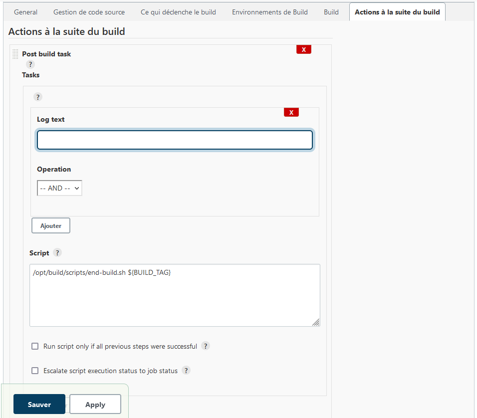

# Errata

<!-- TOC -->

- [Errata](#errata)
    - [Chapitre 2](#chapitre-2)
        - [Un exemple : Ansible : (§2.3.2)](#un-exemple--ansible--§232)
    - [Chapitre 5](#chapitre-5)
        - [docker events / docker system events (§5.2.6)](#docker-events--docker-system-events-§526)
    - [Chapitre 7](#chapitre-7)
        - [HEALTHCHECK (§7.5.2)](#healthcheck-§752)
    - [Chapitre 10](#chapitre-10)
            - [Configuration du job dans Jenkins (10.4.3)](#configuration-du-job-dans-jenkins-1043)

<!-- /TOC -->

## Chapitre 2

### Un exemple : Ansible : (§2.3.2)

Page 45, il est mentionné que "toutes les machines de l'inventaire" ne représente dans ce cas qu'un seul hôte au regard de l'exemple précédent. Or l'exemple en question qui se trouve à la page précédente fait état du fichier /etc/ansible/hosts qui contient 5 hosts.
Il s'agit d'une erreur.
En effet dans l'exemple "all" représente bien 5 machines et non une seule.

## Chapitre 5

### docker events / docker system events (§5.2.6)

Le paragraphe parle d'un conteneur nommé "tiny_bassi" alors que les logs et les commandes sont relatives à un conteneur nommé "nginx".
Il suffit de s'assurer que le conteneur créé soit effectivement nommé correctement, par exemple:
```
docker run -d --name nginx nginx
```

## Chapitre 7

### HEALTHCHECK (§7.5.2)

La version de Flask utilisée dans ce paragraphe n'est plus compatible avec les versions récentes de python. Nous utiliserons donc la version 2.1.2.

## Chapitre 10

#### Configuration du job dans Jenkins (10.4.3)

* Sur la page 236 du livre on indique, dans le texte, qu'il faut installer le plugin "PostBuildScript".
Il s'agit en fait du plugin "Post build task".
La capture d'écran de l'interface de Jenkins est en revanche correcte. 

* Dans le menu déroulant "Actions à la suite du build" c'est "Post build task" qu'il faut selectionner. Il n'y a pas de menu "Script" (ou du moins celui-ci ne correspond pas à ce que nous devons utiliser).

* La capture d'écran de la page 240 est redimensionnée de sorte qu'elle est difficile à lire. Elle est de plus incorrecte car le champ "Log text" doit rester vide de sorte que le script s'exécute après chaque build quoi qu'il arrive. Voici la version en taille originale ci-dessous:

