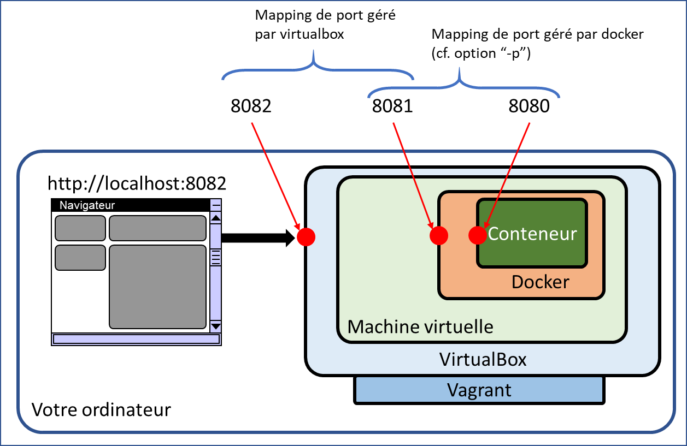
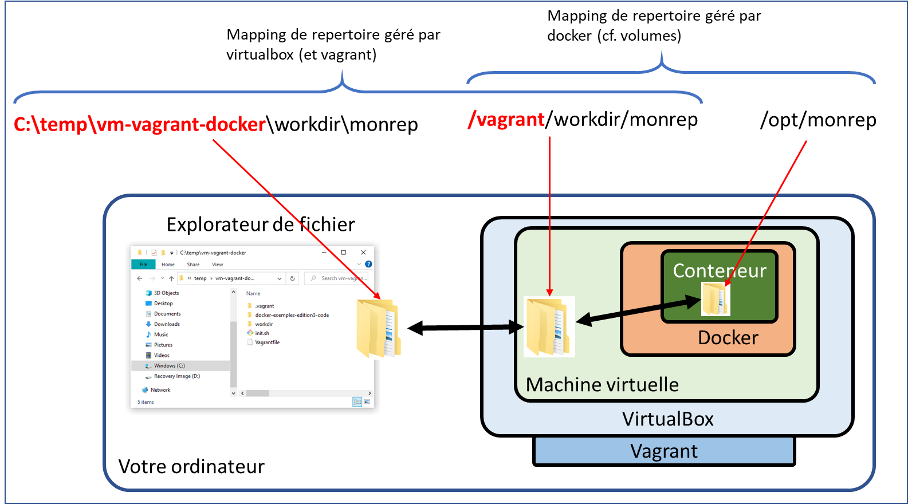

# Chapitre 3

<!-- TOC depthFrom:2 -->

- [1- Installation de l'environnement Docker Linux avec Vagrant](#1--installation-de-lenvironnement-docker-linux-avec-vagrant)
    - [1.1- IMPORTANT : A lire avant de commencer](#11--important--a-lire-avant-de-commencer)
    - [1.2- Installation de l'environnement Vagrant](#12--installation-de-lenvironnement-vagrant)
    - [1.3- Recommandations et outils complémentaires](#13--recommandations-et-outils-complémentaires)
    - [1.4- Lien entre votre poste, la machine virtuelle et docker](#14--lien-entre-votre-poste-la-machine-virtuelle-et-docker)
    - [1.5- Puis-je utiliser un autre environnement ?](#15--puis-je-utiliser-un-autre-environnement-)
- [2- Commandes du chapitre](#2--commandes-du-chapitre)
    - [Linux sous VirtualBox (§3.2.2)](#linux-sous-virtualbox-§322)
        - [Une VM Rocky Linux](#une-vm-rocky-linux)
        - [Démarrage et arrêt de votre machine virtuelle](#démarrage-et-arrêt-de-votre-machine-virtuelle)
        - [Installation de Docker dans votre VM](#installation-de-docker-dans-votre-vm)
    - [Premier conteneur (§3.3.1)](#premier-conteneur-§331)
    - [API Docker Remote (§3.3.2)](#api-docker-remote-§332)
        - [Modifier la configuration du démon Docker](#modifier-la-configuration-du-démon-docker)
- [3- Liens (dans l'ordre d'apparition dans le chapitre)](#3--liens-dans-lordre-dapparition-dans-le-chapitre)

<!-- /TOC -->

## 1- Installation de l'environnement Docker Linux avec Vagrant

### 1.1- IMPORTANT : A lire avant de commencer

Le dépôt GitHub que vous êtes en train de consulter ne contient que le contenu documentaire. Un autre dépôt a été préparé avec le code, les scripts et autres exemples relatifs à d'autres chapitres.

La raison de ce choix est d'éviter les problèmes de compatibilité notamment avec windows qui a une fâcheuse tendance à utiliser d'autres caractères pour les fin de lignes, ce qui a des conséquences ennuyeuses pour le fonctionnement de certains scripts.

En procédant de la sorte nous garantissons un fonctionnement complètement homogène sous Linux par l'usage de Vagrant.

### 1.2- Installation de l'environnement Vagrant

1. Créez un répertoire ```vm-vagrant-docker``` sur votre machine.
2. Copiez les fichiers se trouvant dans le répertoire [vm-vagrant-docker](../../vm-vagrant-docker/) de ce dépôt GitHub.
3. Créez dans ce répertoire un fichier ```init.sh``` contenant le code suivant:

```
#!/bin/sh
sudo yum install -y net-tools
sudo yum install -y git
sudo yum install -y dos2unix
sudo yum install -y python2
```

4. Créez dans ce même répertoire un second fichier ```Vagrantfile``` (veillez à respecter la casse) contenant le code suivant :

```
Vagrant.configure("2") do |config|
  config.vm.box = "rockylinux/8"
  config.vm.box_version = "4.0.0"
  config.vm.network "forwarded_port", guest: 8000, host: 8000, auto_correct: true
  config.vm.network "forwarded_port", guest: 8001, host: 8001, auto_correct: true
  config.vm.network "forwarded_port", guest: 8080, host: 8080, auto_correct: true
  config.vm.network "forwarded_port", guest: 8081, host: 8081, auto_correct: true
  config.vm.network "forwarded_port", guest: 8090, host: 8090, auto_correct: true 
  config.vm.usable_port_range = 8000..9100
  config.vm.provision "shell", path: "init.sh"
end
```

> **ATTENTION** : Notez bien que seuls certains ports sont ouverts entre la machine virtuelle et votre hôte (8000, 8001, 8080, 8081, 8090). Ces ports seront utilisés dans le cadre des différents exercices du livre. Si vous rencontrez un problème pensez à vérifier que vous n'utilisez pas un port "bloqué". Vous trouverez quelques explications additionnelles [ici](#14--lien-entre-votre-poste-la-machine-virtuelle-et-docker).


5. Ouvrez un terminal dans ce même répertoire.
> Pour windows vous pouvez utiliser CMD, Powershell ou le Shell git. Nous vous recommandons aussi de considérer l'installation de [Windows terminal](https://docs.microsoft.com/fr-fr/windows/terminal/) qui améliore nettement le terminal par défaut de windows.

6. Comme indiqué en page 65 du livre, lancez la commande suivante:

```
vagrant up --provider virtualbox
```

L'installation devrait se terminer par la séquence suivante:

```
    default: Installed:
    default:   python2-2.7.18-7.module+el8.5.0+718+67e45b5f.rocky.0.2.x86_64
    default:   python2-libs-2.7.18-7.module+el8.5.0+718+67e45b5f.rocky.0.2.x86_64
    default:   python2-pip-9.0.3-18.module+el8.4.0+403+9ae17a31.noarch
    default:   python2-pip-wheel-9.0.3-18.module+el8.4.0+403+9ae17a31.noarch
    default:   python2-setuptools-39.0.1-13.module+el8.4.0+403+9ae17a31.noarch
    default:   python2-setuptools-wheel-39.0.1-13.module+el8.4.0+403+9ae17a31.noarch
    default:
    default: Complete!
```

7. Une fois l'installation terminée, connectez-vous dans la machine virtuelle ainsi créée:

```
vagrant ssh
```

Une fois connecté vous devriez voir l'invite de commande suivante:

```
[vagrant@localhost ~]$
```

8. Placez vous dans le répertoire ```/vagrant``` avec la commande suivante:

```
cd /vagrant
```

L'invite de commande devrait changer comme suit:

```
[vagrant@localhost vagrant]$
```

Comme indiqué dans le livre ce répertoire est associé au répertoire dans lequel nous avons lancé notre ```vagrant up```. Toutes les modifications qui seront effectuées dans la machine Linux Vagrant se verront donc sur le système hôte et vice versa.

Sous Windows nous vous déconseillons fortement de toucher aux fichiers depuis Windows. Les différences liées au fameux CRLF sont pénibles à gérer. Opérez confortablement en ligne de commande à l'intérieur de votre machine Vagrant Linux.

8. Clonez le repository contenant le code:

```
git clone https://github.com/dunod-docker/docker-exemples-edition3-code.git
```

Si vous lancez la commande :
```
ls -1
```

Vous devriez maintenant obtenir le résultat suivant:
```
docker-exemples-edition3-code
init.sh
Vagrantfile
```

Le répertoire ```docker-exemples-edition3-code``` est celui qui contient le code source pour différents chapitres.
Nous y reviendrons en temps voulu.

Retournez maintenant à la page 66 pour commencer à utiliser votre nouvelle ligne de commande.

### 1.3- Recommandations et outils complémentaires

Nous travaillerons sous Linux.
Vous avez donc besoin de connaissances minimales relatives à ce système, dont voici quelques exemples:
* Naviguer dans l'arborescence de fichier ```ls```, ```cd```
* Supprimer un fichier ou un répertoire ```rm```
* Utiliser ```vi``` pour créer ou modifier un fichier:
    * ```i``` pour débuter l'édition d'un fichier
    * ```q!``` pour quitter vi sans sauver
    * ```wq!``` pour quitter vi après avoir sauvé
    * ```/<recherche>``` pour rechercher une chaine de caractère ```<recherche>```
    * ```:1``` pour revenir au début du fichier
    * ```:$``` pour aller à la fin fu fichier

Pour vi nous vous conseillons le site suivant [Aide mémoire vi de l'EPFL](https://enacit1.epfl.ch/guide_unix/vi.html). Il contient bien plus de choses que ce dont vous aurez besoin mais est très abordable.
Ce guide ```vi``` est l'un des chapitres du [Aide mémoire Linux de l'EPFL](https://enacit1.epfl.ch/guide_unix/).

### 1.4- Lien entre votre poste, la machine virtuelle et docker

Ce paragraphe contient des informations additionnelles qui ne sont pas absolument nécessaires. Elles sont à disposition si vous souhaitez comprendre intimement votre environnement de travail.

La figure ci-dessous montre l'architecture de notre environnement vagrant/linux.



Nous présentons ici un une séquence de mapping de ports volontairement complexe:
* le conteneur expose un port 8080
* docker (ou le moteur de conteneur que vous utilisez) réexpose ce port en 8081
* virtualbox (ou un autre moteur de VM utilisée par Vagrant) réexpose ce port en 8082

Dans le livre nous tentons autant que possible d'éviter ce type de mapping. Il y a néanmoins des cas où nous y sommes contraints (cf. [chapitre 10](../chapitre10/README.md) ou [chapitre 11](../chapitre11/README.md)).
Pas d'inquiétude nous l'indiquons clairement à chaque fois.

Il est néanmoins utile de comprendre cette architecture à plusieurs niveaux. En effet, dans le [chapitre 11](../chapitre11/README.md) nous utilisons pour certains exemples "plusieurs" VM (pour simuler plusieurs machines communiquant entre elles).

Le même type de fonctionnement en couches existe aussi pour le système de fichiers.



La plupart des exemples du livre ne nécessitent pas de mapping de fichier sur votre ordinateur. Par défaut, comme expliqué plus haut, le ```Vagrantfile``` que nous proposons crée un mapping entre le répertoire dans lequel vous mettez ce ```Vagrant``` file et ```/vagrant``` dans la machine virtuelle.

> **A noter** : dans le livre quand nous parlons de **l'hôte**, à l'exception des moments dans lesquelles nous vous demandons d'ouvrir un navigateur web, nous parlons de la machine virtuelle qui est bien l'hôte du point de vue du moteur de conteneur.

### 1.5- Puis-je utiliser un autre environnement ?

Avant de répondre à cette question, nous conseillons de lire le paragraphe précédent.

Si vous disposez d'un PC sur lequel vous ne pouvez pas installer Vagrant ou Virtualbox (ce qui est malheureusement le cas sur un Mac M1 par exemple), vous pouvez utiliser [Docker Desktop](https://www.docker.com/products/docker-desktop/) ou [Rancher Desktop](https://rancherdesktop.io/) par exemple.

En réalité ces outils fonctionnent exactement de la même manière que l'environnement que nous proposons (mais en masquant l'essentiel de la complexité). Nous abordons ce sujet dans les chapitres 1 et 2. N'hésitez pas à vous y reporter.

Dans le cas où vous ne choisissiez pas notre environnement l'essentiel des exemples fonctionneront de la même manière.

Par contre pour les chapitres 8 et 11 dans lesquels nous abordons des concepts avancés en matière de gestion du réseau ou des exemples multi-machines, vous vous trouverez limité avec un environnement "Desktop" classique.

## 2- Commandes du chapitre 

### Linux sous VirtualBox (§3.2.2)

#### Une VM Rocky Linux

```
cat /etc/os-release | head -n 1
```

```
exit
```

#### Démarrage et arrêt de votre machine virtuelle

```
vagrant suspend
```

```
vagrant resume
```

```
vagrant ssh
```

#### Installation de Docker dans votre VM
```
sudo su
yum-config-manager \
    --add-repo \
    https://download.docker.com/linux/centos/docker-ce.repo 
yum install -y docker-ce-20.10.12-3.el8
systemctl start docker
systemctl enable docker
docker run hello-world
usermod -aG docker vagrant
```

Comme indiqué dans le livre, vous devez vous déconnecter de la machine virtuelle pour que les changements soient pris en compte.

```
exit
exit
```

Le premier exit vous sort du mode "sudo su" et le second de la machine virtuelle.

Reconnectez-vous avec 

```
vagrant ssh
```

Cette fois docker est disponible en ligne de commande sous l'utilisateur ```vagrant```:

```
docker ps
```

devrait afficher

```
[vagrant@localhost ~]$ docker ps
CONTAINER ID   IMAGE     COMMAND   CREATED   STATUS    PORTS     NAMES
```


### Premier conteneur (§3.3.1)

```
sudo yum install -y socat
socat -v UNIX-LISTEN:/tmp/socatproxy.sock,fork,reuseaddr UNIX-CONNECT:/var/run/docker.sock &
docker -H unix:///tmp/socatproxy.sock ps -a
```

Pensez à noter le numéro de processus socat, par exemple "11015" dans l'exemple ci-dessous:
```
[vagrant@localhost ~]$ [vagrant@localhost ~]$ socat -v UNIX-LISTEN:/tmp/socatproxy.sock,fork,reuseaddr UNIX-CONNECT:/var/run/docker.sock &
[3] 11015
```

Le numéro de processus sera utile pour arrêter socat à la fin de ce chapitre


### API Docker Remote (§3.3.2)
```
sudo systemctl stop docker
sudo dockerd -H tcp://0.0.0.0:2375 &
grep -f /var/run/docker.sock 
docker ps 
docker -H 0.0.0.0:2375 info
export DOCKER_HOST="tcp://0.0.0.0:2375"
sudo yum install -y jq
curl http://localhost:2375/info |jq
```

> ATTENTION : pensez à redémarrer votre VM !!!!

#### Modifier la configuration du démon Docker

```
sudo vi /usr/lib/systemd/system/docker.service
sudo systemctl daemon-reload
sudo systemctl restart docker
sudo netstat -lntp | grep dockerd
```

Cleanup, pensez à stopper socat avec la commande ```kill <numéro de processus>```

## 3- Liens (dans l'ordre d'apparition dans le chapitre)

https://www.vagrantup.com/

https://www.virtualbox.org/

https://waterlan.home.xs4all.nl/dos2unix.html

https://wiki.freedesktop.org/www/Software/systemd/

https://fr.wikipedia.org/wiki/Representational_state_transfer

https://docs.docker.com/desktop/mac/install/

https://docs.docker.com/desktop/windows/install/

https://fr.wikipedia.org/wiki/Berkeley_sockets#Socket_unix

http://www.dest-unreach.org/socat/

https://docs.docker.com/engine/security/rootless/

https://docs.docker.com/engine/api/version-history/

https://stedolan.github.io/jq/

https://docs.docker.com/engine/install/linux-postinstall/#configure-where-the-docker-daemon-listens-for-connections

